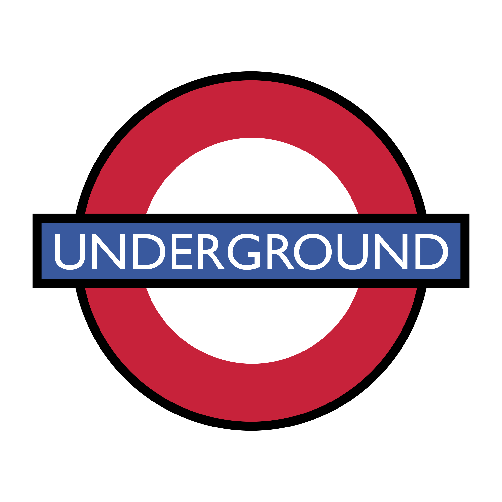
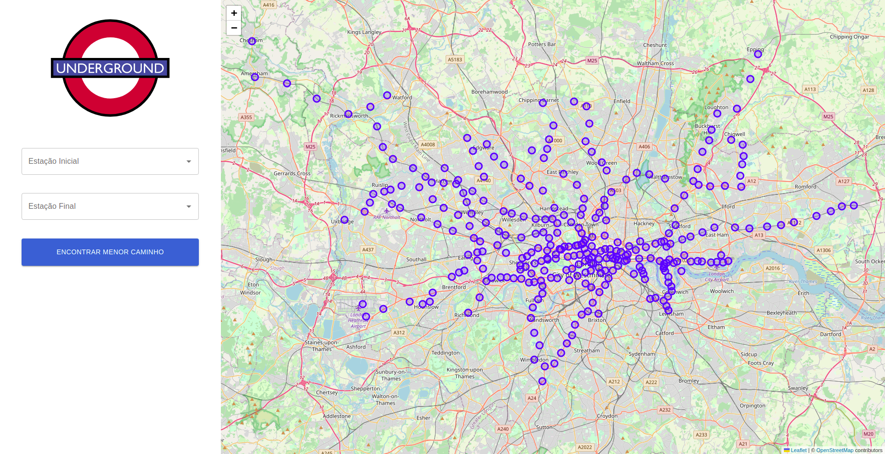
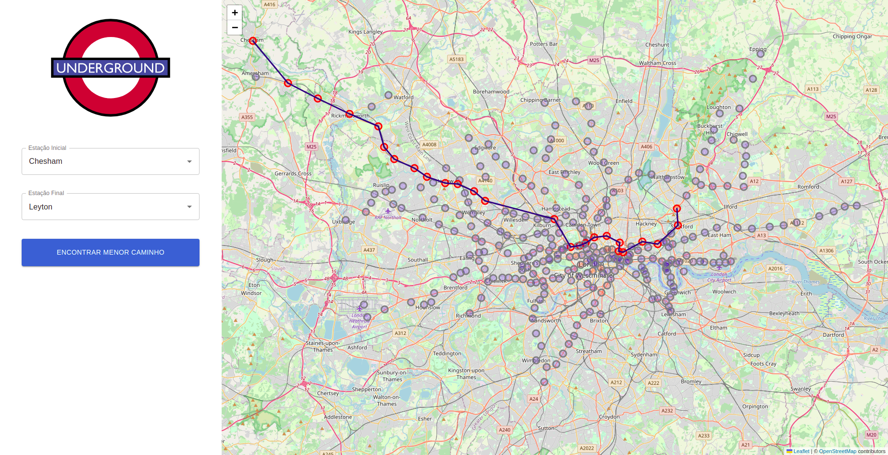
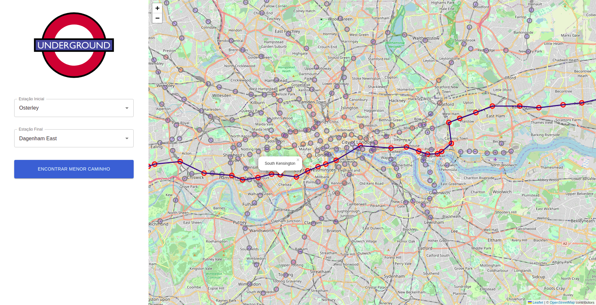

# London Underground




**Número da Lista**: 6<br>
**Conteúdo da Disciplina**: Final<br>

## Alunos
|Matrícula | Aluno |
| -- | -- |
| 17/0080102  |  Lucas Gomes Lopes |
| 19/0106565  |  Fernando Miranda Calil |

## Sobre 
O sistema de metrô de Londres, também conhecido como London Underground, é o mais antigo e um dos mais extensos do mundo. Este projeto visa encontrar o menor caminho entre duas estações de metrô utilizando o Algoritmo A*(A-estrela). Os dados deste sistema foram adaptados [desse repositório](https://github.com/nicola/tubemaps/tree/master/datasets).

## Screenshots







## Instalação 
**Linguagem**: Javascript<br>
**Framework**: ReactJS<br>

Siga as instruções a seguir :

1) Clonar o repositório:

```sh 
git clone git@github.com:projeto-de-algoritmos/Final_LondonUnderground.git
```

2) Acessar a pasta da aplicação React:

```sh 
cd Final_LondonUnderground
```

3) Instalar as dependências:

```sh 
npm install
```

4) Execute a aplicação:

```sh 
npm start
```
## Uso 
Selecione uma Estação Inicial e uma Estação Final e clique em "Encontrar Menor Caminho" para que o algoritmo calcule e retorne a menor rota.


